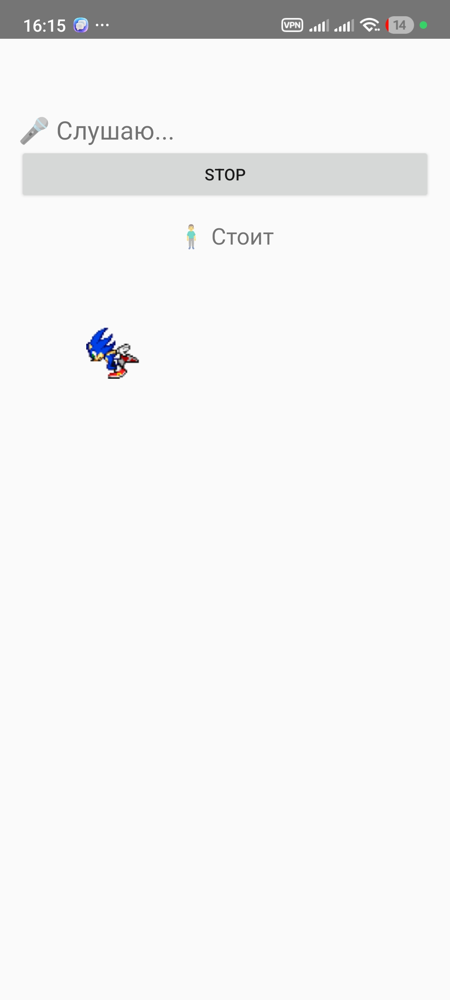

# Структура проекта VoiceCommandsApp

## 1. `gradle/libs.versions.toml`

**Роль:** Каталог версий (Version Catalog).

**Значение:** Централизованное управление всеми зависимостями и плагинами проекта. Позволяет избежать дублирования версий и упрощает их обновление.

### Листинг

```toml
[versions]
agp = "8.7.2"
kotlin = "2.0.21"
coreKtx = "1.13.1"
...

[libraries]
androidx-core-ktx = { group = "androidx.core", name = "core-ktx", version.ref = "coreKtx" }
...

[plugins]
android-application = { id = "com.android.application", version.ref = "agp" }
kotlin-android = { id = "org.jetbrains.kotlin.android", version.ref = "kotlin" }
```

---

## 2. `build.gradle.kts` (Root)

**Роль:** Корневой файл сборки проекта.

**Значение:** Определяет плагины, которые будут доступны во всех модулях проекта, но не применяет их сразу (`apply false`).

### Листинг

```kotlin
plugins {
    alias(libs.plugins.android.application) apply false
    alias(libs.plugins.kotlin.android) apply false
    alias(libs.plugins.compose.compiler) apply false
}
```

---

## 3. `settings.gradle.kts`

**Роль:** Настройки проекта Gradle.

**Значение:** Определяет имя проекта, включает модули (например, `:app`) и настраивает репозитории для поиска зависимостей (`Google`, `Maven Central`).

### Листинг

```kotlin
rootProject.name = "VoiceCommandsApp"
include(":app")

dependencyResolutionManagement {
    repositoriesMode.set(RepositoriesMode.FAIL_ON_PROJECT_REPOS)
    repositories {
        google()
        mavenCentral()
    }
}
```

---

## 4. `app/build.gradle.kts`

**Роль:** Сценарий сборки модуля приложения.

**Значение:** Содержит конфигурацию Android (SDK, ID приложения), настройки компилятора Kotlin и список всех библиотек (Vosk, AppCompat, Compose).

### Листинг (фрагмент)

```gradle
android {
    namespace = "com.example.voicecommandsapp"
    compileSdk = 35
    ...
}

dependencies {
    implementation("com.alphacephei:vosk-android:0.3.47")
    implementation(libs.androidx.core.ktx)
    ...
}
```

---

## 5. `app/src/main/AndroidManifest.xml`

**Роль:** Манифест приложения.

**Значение:** Главный конфигурационный файл Android OS. Декларирует разрешение на запись аудио (`RECORD_AUDIO`), главную Activity и тему приложения.

### Листинг

```xml
<manifest ...>
    <uses-permission android:name="android.permission.RECORD_AUDIO"/>

    <application ...>
        <activity android:name=".MainActivity" android:exported="true">
            <intent-filter>
                <action android:name="android.intent.action.MAIN" />
                <category android:name="android.intent.category.LAUNCHER" />
            </intent-filter>
        </activity>
    </application>
</manifest>
```

**Merge Into Manifest**

---

## 6. `app/src/main/res/layout/activity_main.xml`

**Роль:** Разметка интерфейса.

**Значение:** Описывает визуальную структуру экрана: текстовые поля для отображения речи и команд, кнопку управления и `ImageView` для отображения персонажа.

### Листинг (структура)

```xml
<LinearLayout ... orientation="vertical">
    <TextView android:id="@+id/textSpeech" ... />     <!-- Распознанный текст -->
    <TextView android:id="@+id/textCommand" ... />    <!-- Результат команды -->
    <Button android:id="@+id/btnStartStop" ... />
    <ImageView android:id="@+id/character" ... />     <!-- Спрайт персонажа -->
</LinearLayout>
```

---

## 7. `app/src/main/java/com/example/voicecommandsapp/MainActivity.kt`

**Роль:** Основная логика приложения (Controller / Logic).

**Значение:** «Сердце» приложения. Выполняет следующие задачи:

1. **Инициализация Vosk** — копирует модель из `assets` во внутреннюю память и запускает `SpeechService`.
2. **Обработка голоса** — реализует `RecognitionListener` для получения текста.
3. **Логика команд** — функция `handleCommand()` ищет ключевые слова («беги», «прыгай», «стой») в тексте.
4. **Анимация** — использует `Handler` для циклической смены кадров (спрайтов) в зависимости от состояния (`currentState`).

### Листинг (ключевые моменты)

```kotlin
class MainActivity : AppCompatActivity(), RecognitionListener {

    // Состояния: idle, run, attack, jump
    private var currentState = "idle"

    // Обработка команд
    private fun handleCommand(text: String) {
        when {
            command.contains("беги") -> runRight()
            command.contains("прыж") -> jumpCharacter()
            ...
        }
    }

    // Цикл анимации (смена кадров каждые 120 мс)
    private fun startAnimationLoop() { ... }
}
```

---

## 8. `app/src/main/assets/vosk-model-small-ru-0.22`

**Роль:** Ресурс (модель данных).

**Значение:** Оффлайн-модель для распознавания русской речи. Приложение копирует её при первом запуске, чтобы Vosk мог работать без подключения к интернету.

## 9. `Скриншот`


